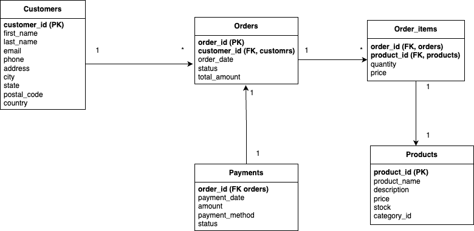

# 1. ER diagram
<div align="center">
  
</div>
<br>

##  SQL queries used in this task

1. show tables;
2. describe <table_name> (e.g. describe payments;)

> le resultat de command describe montre les cle primaire de chaque table.

# 2. Insights and Observations
## Customers 
- count: 15 clients : ```select count(*) from customers;```.
- le clients sont divise equitablement sur les differents pays (3 clients dans chaque pays), en peut voir ca atravers la commande ```select country, count(*) from customers group by country;```

## Orders
- count: 100 orders :  ```select count(*) from orders;```.
- la valuer total de tout les "orders" est 52427.11 : ```select sum(total_amount) from orders;```
- le client **Alice Johnson** est le plus en term de consomation avec un total des command egal a 7484.76 : ```select first_name, last_name, sum(total_amount) as total from orders o join customers c on o.customer_id = c.customer_id group by c.customer_id order by total desc limit 1;```

## Payments
- count: 100 operation de paiement ```select count(*) from payments;```.
- on peut voir que la payment par carte debit est le plus utilise, par 32 operations ```select payment_method, count(*) as count from payments group by payment_method order by count desc;```
- on peut voir que tous les "orders" sont payes completement a traver cette command ```select o.total_amount as total_amount, sum(p.amount) as total_paye, total_amount-sum(p.amount) as  reste from orders o join payments p on o.order_id = p.order_id group by p.order_id;```

## Products
- count : 16 produits ```select count(*) from products;```
- le produit le plus chere est "Laptop" du prix 999.99 ```select product_name , price from products order by price desc limit 1;```
- le produit le moins chere est "Vacuum Cleaner" du prix 129.99 ```select product_name , price from products order by price limit 1;```
